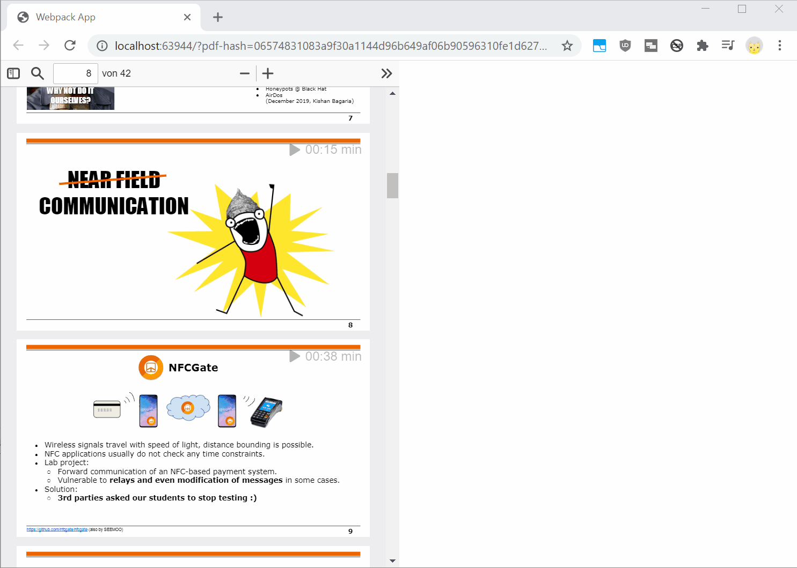

# Slideo: Synchronize Slides With Video

[](https://github.com/sponsors/hediet)
[](https://www.paypal.com/cgi-bin/webscr?cmd=_s-xclick&hosted_button_id=ZP5F38L4C88UY&source=url)
[](https://twitter.com/intent/follow?screen_name=hediet_dev)

This tool matches video frames against PDF pages by using computer vision.
It also ships a web app in which you can click on a PDF page to play the video from the first frame showing the page.
Its primary use-case is to quickly play a recorded lecture from a given slide.

Works best if the PDF page in the video is captured through screen recording and video is 1080p, but it might work in other scenarios too (rotation, shifting, scaling, obstruction and additional on-screen content is supported).

**See [Background](./BACKGROUND.md) for building instructions and how the matching algorithm works.**

_This is tool is more a proof of concept rather than a polished product. Please reach out if you want to make a nice open source product out of it._



## Installation

See [Releases](https://github.com/hediet/slideo/releases).
An installer is not yet provided. Feel free to contribute!

### Windows Requirements

-   [Microsoft Visual C++ Redistributable für Visual Studio 2019](https://visualstudio.microsoft.com/de/downloads/#microsoft-visual-c-redistributable-for-visual-studio-2019)

### Linux, Mac Requirements

(untested)

-   OpenCV 4.5.2
-   Poppler

## Usage

### Synchronize a Set of PDFs With a Set of Videos

Any given lecture slide can appear in any given video.
For performance and accuracy, keep the amount of pdf files small and prefer seperate invocations.
Synchronizing an entire lecture (<1000 slides) should work well though.

```sh
slideo lecture1.pdf lecture2.pdf video1.mp4 video2.mp4
```

When you know that video1 does not contain any slides of lecture2, you can do this to improve accuracy:

```sh
slideo lecture1.pdf video1.mp4 --non-interactive && slideo lecture2.pdf video2.mp4 --non-interactive
```

### View a Synchronized PDF

```
slideo lecture1.pdf
```

This will spawn a webserver on port 63944 and print an url that you can open in your favorite browser to open the viewer.

**You can drag&drop any processed PDF into the viewer!**

## TODO

-   Use wry to build a proper web GUI.
-   Use rustcv to get rid of the OpenCV dependency.

# Other Stuff You Might Like

-   ## [Browser Extension: Improved GitHub Issue Editor](https://github.com/hediet/browser-ext-github-monaco)
-   ## Draw.io for [VS Code](https://github.com/hediet/vscode-drawio) and [IntelliJ](https://github.com/docToolchain/diagrams.net-intellij-plugin)
-   ## [Debug Visualizer for VS Code](https://github.com/hediet/vscode-debug-visualizer)

A big **Thank You** to all my sponsors on GitHub!
